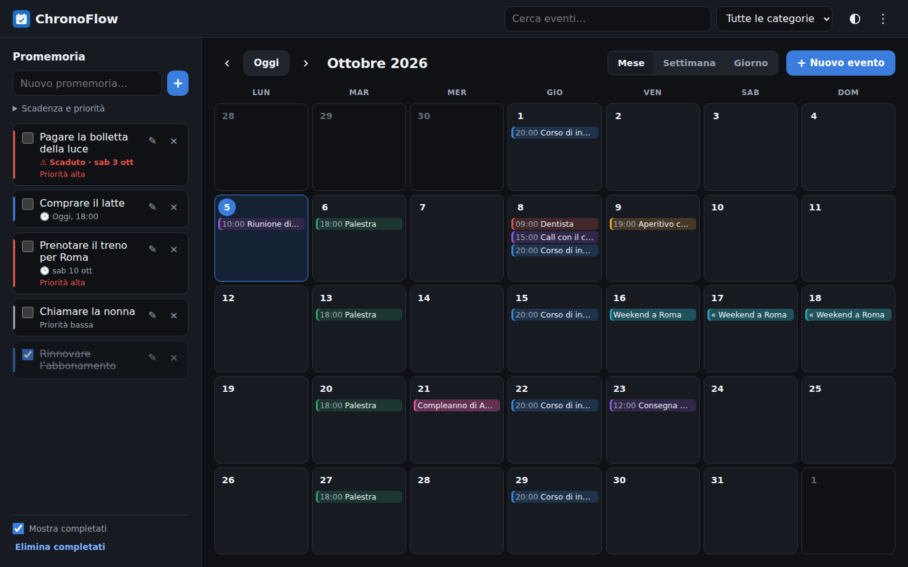
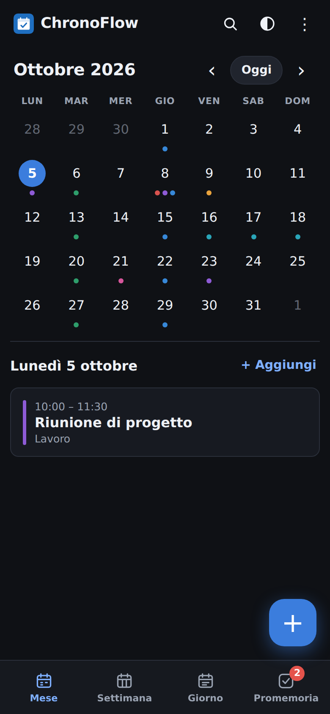
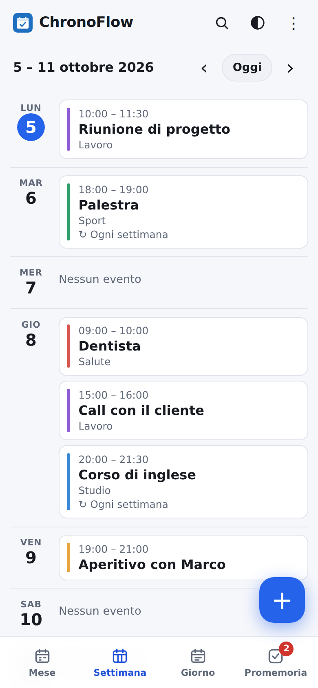

<div align="center">


# ChronoFlow

Calendario e promemoria personali, con notifiche push sul telefono.
Funziona nel browser e si installa come app (PWA).

[](https://github.com/federicogiraldi/ChronoFlow/actions/workflows/ci.yml)




&nbsp;

&nbsp;


</div>

## Cosa fa

- **Calendario** mese, settimana e giorno; eventi con orario o di tutto il giorno, colore, categoria, ripetizione (giorno, settimana, mese, anno).
- **Promemoria** con scadenza e priorità.
- **Notifiche push** prima degli eventi e alla scadenza dei promemoria, anche ad app chiusa.
- **Ricerca**, filtro per categoria, import/export **`.ics`** (Google, Apple, Outlook).
- **Installabile e offline**: senza connessione si consultano i dati, ma non si modificano.
- **Tema** chiaro/scuro e **password** di accesso.

Sul telefono: tocca un giorno del mese per vederne gli eventi, usa la barra in basso per cambiare vista o aprire i promemoria e il pulsante **+** per creare un evento. Scorri a destra/sinistra per cambiare periodo. Le notifiche si attivano dal menu **⋮**.

## Come funziona

```
Browser / app installata ──/api (JSON)──▶ Node.js + Express ──▶ SQLite (locale) o Turso (online)
        │                                        ▲
   service worker                     cron-job.org, ogni minuto:
   (cache offline)                    /api/cron/notify → invia le notifiche push
```

- **Frontend** (`frontend/`): HTML, CSS e JavaScript senza framework. Gli eventi ripetuti sono salvati una volta sola e le ripetizioni sono calcolate nel browser.
- **Backend** (`backend/`): Express valida i dati e li salva nel database. In locale parte con `backend/server.js`; su Vercel la stessa app gira come funzione serverless (`api/index.js`).
- **Notifiche**: ogni dispositivo si iscrive alle push; ogni minuto il server controlla cosa è in scadenza e invia l'avviso tramite il servizio push del telefono, una sola volta.

Per installarla, pubblicarla online o modificarla: [docs/setup.md](docs/setup.md).

## Limiti

- Le notifiche possono arrivare fino a un minuto in ritardo (il controllo è ogni minuto).
- Gli orari sono in ora locale: pensato per un solo fuso orario.
- Modifiche ed eliminazioni di un evento ripetuto valgono per tutta la serie.
- I promemoria non sono inclusi nell'export `.ics`.
