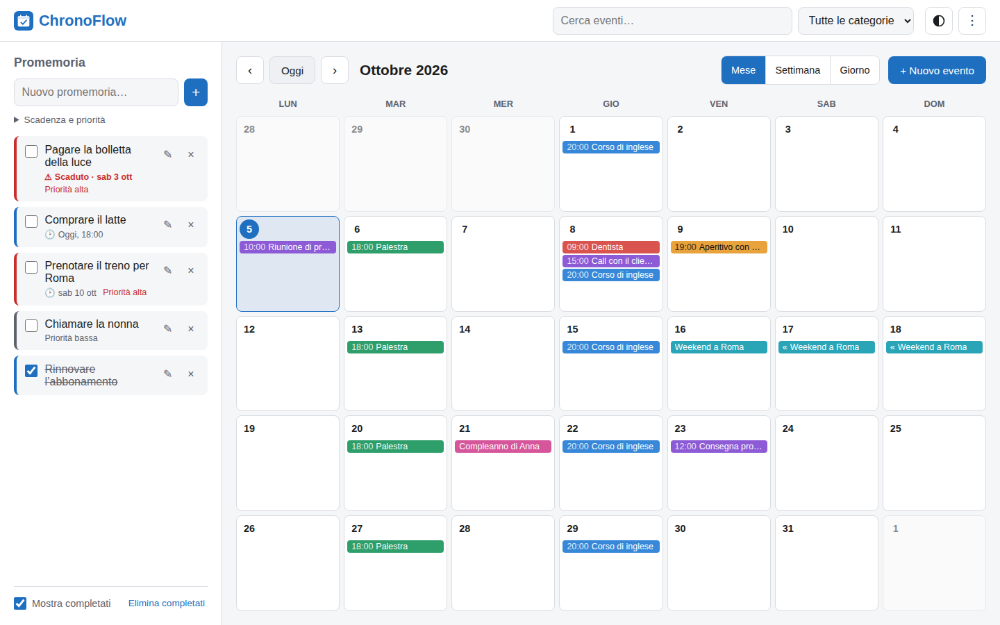
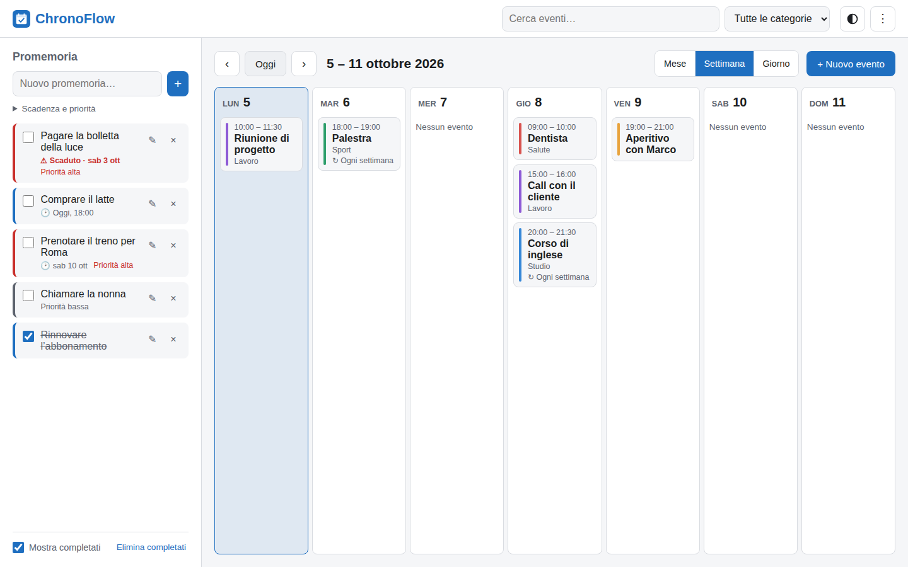
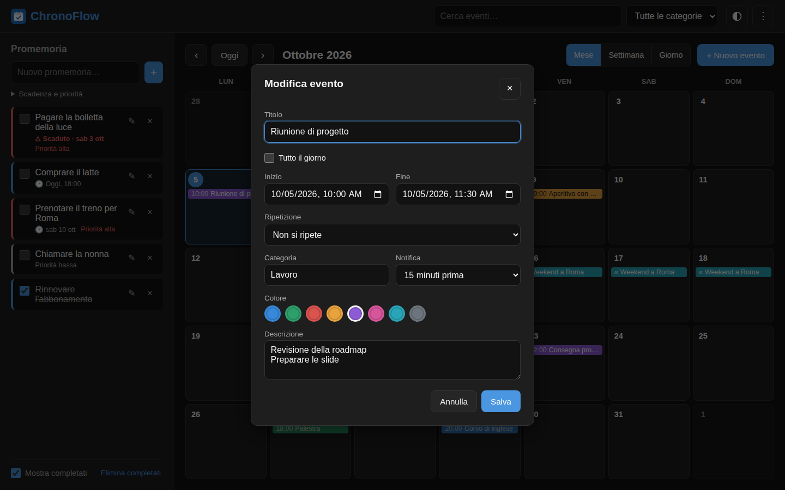
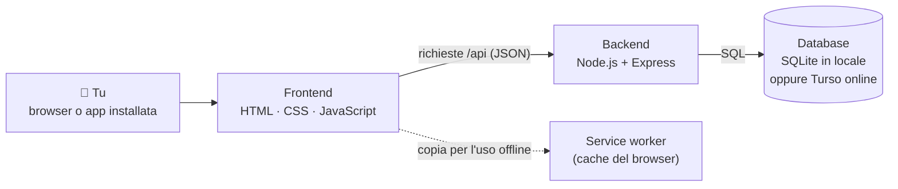

<div align="center">


# ChronoFlow

**Il tuo calendario e i tuoi promemoria, in un'unica app semplice.**
Funziona nel browser, si installa sul telefono come una vera app e resta consultabile anche senza connessione.

[](https://github.com/federicogiraldi/ChronoFlow/actions/workflows/ci.yml)


</div>

---

## Indice

- [Cosa sa fare](#-cosa-sa-fare)
- [Screenshot](#-screenshot)
- [Guida all'uso](#-guida-alluso)
- [Avvio rapido sul tuo computer](#-avvio-rapido-sul-tuo-computer)
- [Pubblicarla online gratis](#%EF%B8%8F-pubblicarla-online-gratis-vercel--turso)
- [Come funziona](#-come-funziona)
- [Configurazione](#%EF%B8%8F-configurazione)
- [Sviluppo e test](#-sviluppo-e-test)
- [API](#-api)
- [Limiti noti](#%EF%B8%8F-limiti-noti)

---

## ✨ Cosa sa fare

|     |                                                                                                           |
| --- | --------------------------------------------------------------------------------------------------------- |
| 📅  | **Calendario** con vista mese, settimana e giorno                                                         |
| 🗓️  | **Eventi** con orario o di tutto il giorno, anche su più giorni, con colore, categoria e descrizione      |
| 🔁  | **Eventi che si ripetono** ogni giorno, settimana, mese o anno, con una data di fine se serve             |
| ✅  | **Promemoria** con scadenza e priorità; quelli scaduti sono evidenziati in rosso                          |
| 🔔  | **Notifiche** prima di un evento (da "all'inizio" a "1 giorno prima") e alla scadenza dei promemoria      |
| 🔍  | **Ricerca** degli eventi e **filtro** per categoria                                                       |
| 📥  | **Import ed export `.ics`** per passare gli eventi da e verso Google Calendar, Apple Calendario o Outlook |
| 🌗  | **Tema** chiaro, scuro o automatico (segue l'impostazione del dispositivo)                                |
| 📱  | **Installabile** su telefono e computer, e **consultabile offline**                                       |
| 🔒  | **Protetta da password** quando la pubblichi online                                                       |
| ♿  | **Usabile da tastiera** e con gli screen reader                                                           |

---

## 📸 Screenshot

<table>
  <tr>
    <td width="50%"></td>
    <td width="50%"></td>
  </tr>
  <tr>
    <td align="center"><sub>Tema chiaro</sub></td>
    <td align="center"><sub>Vista settimana</sub></td>
  </tr>
  <tr>
    <td colspan="2"></td>
  </tr>
  <tr>
    <td colspan="2" align="center"><sub>Creazione e modifica di un evento</sub></td>
  </tr>
</table>

<p align="center">
  
  &nbsp;&nbsp;
  
  <br />
  <sub>Sullo smartphone: calendario e pannello dei promemoria</sub>
</p>

---

## 📖 Guida all'uso

### Muoversi nel calendario

- Usa **‹** e **›** per andare al mese, alla settimana o al giorno precedente e successivo. **Oggi** ti riporta alla data corrente, che è sempre evidenziata in blu.
- Cambia vista con **Mese**, **Settimana** e **Giorno**. Cliccando sul **numero di un giorno** apri direttamente la sua vista.
- Sul telefono puoi anche **scorrere con il dito** verso destra o sinistra per cambiare periodo.
- Se in un giorno ci sono troppi eventi, compare **"+N altri"**: cliccalo per vederli tutti.

### Creare un evento

1. Premi **+ Nuovo evento**, oppure clicca su uno spazio vuoto di un giorno: l'evento sarà già impostato su quella data.
2. Scrivi il **titolo** e scegli **inizio** e **fine**. Spunta **Tutto il giorno** per compleanni, ferie e simili.
3. Se vuoi, imposta anche:
   - **Ripetizione**: ogni giorno, settimana, mese o anno, con una data di fine se serve
   - **Categoria**, ad esempio "Lavoro" o "Sport": le categorie già usate vengono suggerite
   - **Notifica**: quanto tempo prima vuoi essere avvisato
   - **Colore** e **descrizione**
4. Premi **Salva**.

Cliccando su un evento ne vedi i dettagli. Da lì puoi **Modificarlo**, **Duplicarlo** (comodo per eventi simili) o **Eliminarlo**.

> Per un evento che si ripete, modifica ed eliminazione valgono per **tutte** le ripetizioni.

### Promemoria

I promemoria sono le cose da fare, nella colonna a sinistra. Sul telefono si aprono con il pulsante **✓** in alto, il cui numero rosso indica quanti sono in scadenza.

- Scrivi il testo e premi **Invio** o **+**. Apri **"Scadenza e priorità"** per aggiungere una data e un'importanza.
- **Spunta** la casella quando hai finito: il promemoria viene barrato.
- Usa **✎** per modificarlo e **×** per eliminarlo.
- **Mostra completati** nasconde o mostra quelli già fatti. **Elimina completati** li cancella tutti insieme.
- L'ordine è automatico: prima le cose da fare, poi quelle con la scadenza più vicina, poi le più importanti.

### Cercare

Scrivi nella casella **Cerca eventi** in alto: vedrai l'elenco di tutti gli eventi che contengono quelle parole nel titolo, nella descrizione o nella categoria. Il menu **Tutte le categorie** mostra solo gli eventi di una categoria.

### Notifiche

1. Apri il menu **⋮** in alto a destra, scegli **Attiva notifiche** e accetta la richiesta del browser.
2. Ricevi un avviso:
   - per ogni evento con una **Notifica** impostata, con il preavviso scelto
   - per ogni promemoria alla sua **scadenza**; se ha solo la data, alle 9:00

> Le notifiche arrivano mentre l'app è aperta, anche in una scheda in background o installata sul telefono. Vedi i [limiti noti](#%EF%B8%8F-limiti-noti).

### Installarla come app

- **iPhone (Safari):** tocca Condividi → **"Aggiungi alla schermata Home"**
- **Android (Chrome):** menu ⋮ → **"Installa app"**
- **Computer (Chrome o Edge):** clicca l'icona di installazione nella barra degli indirizzi

Una volta installata si apre a schermo intero, come un'app normale. Senza connessione puoi ancora consultare calendario e promemoria, ma non modificarli: in quel caso compare una barra gialla.

### Importare ed esportare il calendario

Dal menu **⋮**:

- **Esporta calendario (.ics)** scarica tutti i tuoi eventi in un file. Puoi importarlo in Google Calendar, Apple Calendario o Outlook, oppure tenerlo come backup.
- **Importa calendario (.ics)** aggiunge gli eventi di un file `.ics`, ad esempio esportato da Google Calendar.

### Tema

Il pulsante **◐** in alto cambia il tema, in quest'ordine: **Automatico** (come il dispositivo), **Chiaro**, **Scuro**. La scelta viene ricordata.

### Scorciatoie da tastiera

| Tasto   | Azione                          |
| ------- | ------------------------------- |
| `←` `→` | Periodo precedente / successivo |
| `t`     | Torna a oggi                    |
| `n`     | Nuovo evento                    |
| `m`     | Vista mese                      |
| `s`     | Vista settimana                 |
| `g`     | Vista giorno                    |
| `/`     | Cerca                           |
| `Esc`   | Chiude finestre e pannelli      |

---

## 🚀 Avvio rapido sul tuo computer

Serve [Node.js](https://nodejs.org) **22 o superiore**.

```bash
git clone https://github.com/federicogiraldi/ChronoFlow.git
cd ChronoFlow
npm install
npm start
```

Apri **<http://localhost:3000>**. Il terminale mostra anche l'indirizzo da usare per aprire l'app **dal telefono**, se è collegato alla stessa rete Wi-Fi (ad esempio `http://192.168.1.20:3000`).

I dati vengono salvati nel file `backend/chronoflow.db`. Se avevi già usato la versione 1.0, i tuoi dati vengono aggiornati automaticamente, senza perdite.

---

## ☁️ Pubblicarla online gratis (Vercel + Turso)

Per usare ChronoFlow da qualsiasi posto, ad esempio dal telefono fuori casa, servono due servizi, entrambi **gratuiti** per un uso personale:

| Servizio                         | A cosa serve                                                  |
| -------------------------------- | ------------------------------------------------------------- |
| **[Turso](https://turso.tech)**  | Ospita il **database**, cioè dove vengono salvati i tuoi dati |
| **[Vercel](https://vercel.com)** | Ospita l'**app**: la pagina web e il server che risponde      |

> **Perché due servizi?** Gli hosting gratuiti cancellano i file a ogni riavvio, quindi un database salvato su file andrebbe perso. Turso conserva i dati in modo permanente.

### 1. Crea il database su Turso

1. Registrati su [turso.tech](https://turso.tech). Non serve la carta di credito.
2. Crea un database chiamato `chronoflow` nella regione più vicina a te, ad esempio Francoforte.
3. Dalla pagina del database copia due valori:
   - l'**URL**, che inizia con `libsql://`
   - un **token**, che crei con il pulsante "Create token"

### 2. Pubblica l'app su Vercel

1. Registrati su [vercel.com](https://vercel.com) con il tuo account GitHub. Il piano gratuito si chiama "Hobby".
2. Clicca **Add New → Project** e scegli il repository **ChronoFlow**. Le impostazioni sono già pronte nel file `vercel.json`.
3. Nella sezione **Environment Variables** aggiungi:

   | Nome                  | Valore                                                        |
   | --------------------- | ------------------------------------------------------------- |
   | `DATABASE_URL`        | l'URL di Turso (`libsql://...`)                               |
   | `DATABASE_AUTH_TOKEN` | il token di Turso                                             |
   | `APP_PASSWORD`        | la password con cui entrerai nell'app                         |
   | `SESSION_SECRET`      | una frase casuale lunga, ad esempio da `openssl rand -hex 32` |
   | `NODE_ENV`            | `production`                                                  |

4. Premi **Deploy**. Dopo circa un minuto l'app è online su `https://<nome-progetto>.vercel.app`.

Da quel momento, ogni modifica caricata sul branch `main` viene pubblicata in automatico.

### Spostare online i dati che hai in locale

Nell'app sul tuo computer usa **⋮ → Esporta calendario (.ics)**, poi nell'app online **⋮ → Importa calendario (.ics)**.

> I promemoria non sono inclusi nel formato `.ics` e vanno ricreati.

### Backup

- **Database su Turso:** usa l'export dalla dashboard, oppure il comando `turso db shell chronoflow .dump > backup.sql`.
- **Database in locale:** copia il file `backend/chronoflow.db`.
- **Solo il calendario:** l'export `.ics` è già un backup.

---

## 🧠 Come funziona

ChronoFlow è fatta di due parti:

- **Frontend:** la pagina che vedi nel browser. È scritta in HTML, CSS e JavaScript, senza framework, e disegna il calendario, i form e i promemoria.
- **Backend:** il server, scritto in Node.js con Express. Riceve le richieste dalla pagina, controlla che i dati siano validi e li salva nel database.

Le due parti comunicano tramite un'**API**, una serie di indirizzi come `/api/events` e `/api/reminders` da cui la pagina legge e scrive dati in formato JSON.



Alcuni dettagli:

- **Eventi ripetuti:** nel database un evento che si ripete è salvato **una sola volta**, insieme alla sua regola (ad esempio "ogni settimana"). È il browser a calcolare le singole ripetizioni da mostrare nel calendario.
- **Offline:** il **service worker** è un piccolo programma che il browser tiene attivo in background. Conserva una copia dell'app e degli ultimi dati scaricati, così funziona anche senza connessione.
- **Sicurezza:**
  - Il server controlla ogni dato ricevuto e mostra il testo inserito sempre come semplice testo, quindi non può eseguire codice nascosto (XSS).
  - Dopo il login il browser riceve un **cookie firmato**, che non può essere falsificato.
  - I tentativi di accesso con password sbagliata sono limitati.
- **Due modi di avvio:**
  - **In locale** `backend/server.js` avvia un server normale.
  - **Su Vercel** il file `api/index.js` usa la stessa applicazione come "funzione serverless", mentre la pagina viene servita direttamente dalla rete di Vercel.

### Struttura del progetto

```
api/index.js            Punto di ingresso per Vercel
backend/
  app.js                Applicazione Express (sicurezza, rotte, gestione errori)
  server.js             Avvio del server locale
  config.js             Configurazione dalle variabili d'ambiente
  db.js                 Connessione al database e aggiornamenti automatici dello schema
  auth.js               Login con password e cookie firmato
  validation.js         Controllo dei dati ricevuti
  routes/               Rotte di eventi e promemoria
frontend/
  index.html, style.css
  sw.js                 Service worker (uso offline)
  manifest.webmanifest  Descrizione dell'app installabile
  icons/                Icone
  js/
    main.js             Avvio e gestione delle interazioni
    calendar.js         Disegno delle viste mese, settimana e giorno
    reminders.js        Lista dei promemoria
    recurrence.js       Calcolo delle ripetizioni
    dates.js            Funzioni sulle date
    ics.js              Import ed export .ics
    notifications.js    Notifiche
    theme.js            Tema chiaro e scuro
    api.js, ui.js       Comunicazione con il server e componenti grafici
test/
  unit/                 Test delle funzioni (date, ripetizioni, .ics...)
  api/                  Test del server
  e2e/                  Test nel browser vero (Playwright)
scripts/                Generazione di icone e screenshot, server per i test
```

---

## ⚙️ Configurazione

Le impostazioni si leggono dalle **variabili d'ambiente**. In locale basta copiare `.env.example` in `.env` e modificarlo: `npm start` e `npm run dev` lo leggono in automatico.

| Variabile             | Predefinito                  | Descrizione                                                                         |
| --------------------- | ---------------------------- | ----------------------------------------------------------------------------------- |
| `PORT`                | `3000`                       | Porta del server                                                                    |
| `HOST`                | tutte le interfacce          | Lascialo vuoto: l'app risponde sia da questo PC sia dagli altri dispositivi di casa |
| `DATABASE_URL`        | file `backend/chronoflow.db` | Database: `file:...` in locale, `libsql://...` per Turso                            |
| `DATABASE_AUTH_TOKEN` | –                            | Token di Turso                                                                      |
| `APP_PASSWORD`        | vuota (nessun login)         | Password per entrare nell'app                                                       |
| `SESSION_SECRET`      | ricavato dalla password      | Chiave segreta per firmare il cookie di accesso                                     |
| `SESSION_DAYS`        | `30`                         | Giorni dopo cui bisogna rifare il login                                             |
| `NODE_ENV`            | –                            | `production` attiva le protezioni per l'uso via https                               |

> ⚠️ **Senza `APP_PASSWORD` chiunque raggiunga il server può vedere e modificare i tuoi dati.** Lasciala vuota solo se usi l'app sul tuo computer o nella rete di casa.

---

## 🧪 Sviluppo e test

| Comando                       | Cosa fa                                               |
| ----------------------------- | ----------------------------------------------------- |
| `npm run dev`                 | Avvia il server e lo riavvia a ogni modifica          |
| `npm start`                   | Avvia il server                                       |
| `npm test`                    | Test delle funzioni e delle API                       |
| `npm run test:e2e`            | Test nel browser, su desktop e mobile, con Playwright |
| `npm run lint`                | Controllo della qualità del codice con ESLint         |
| `npm run format`              | Formattazione automatica con Prettier                 |
| `npm run check`               | Lint, formattazione e test insieme                    |
| `node scripts/screenshots.js` | Rigenera gli screenshot di questo README              |

Prima di usare i test nel browser o gli screenshot, installa Chromium una volta con `npx playwright install chromium`.

A ogni push su `main` e a ogni pull request, **GitHub Actions** esegue in automatico lint, formattazione, test, controllo delle dipendenze e test nel browser.

---

## 🔌 API

<details>
<summary><b>Elenco delle rotte</b> (clicca per aprire)</summary>

<br />

Tutte le risposte sono in JSON. In caso di errore la risposta è `{ "error": "messaggio", "details": { "campo": "messaggio" } }`.

Se `APP_PASSWORD` è impostata, tutte le rotte tranne `/api/health` e `/api/auth/*` richiedono il login.

| Metodo   | Rotta                      | Descrizione                                                                        |
| -------- | -------------------------- | ---------------------------------------------------------------------------------- |
| `GET`    | `/api/health`              | Stato del server e del database                                                    |
| `GET`    | `/api/auth/status`         | `{ authRequired, authenticated }`                                                  |
| `POST`   | `/api/auth/login`          | `{ password }`: imposta il cookie di sessione                                      |
| `POST`   | `/api/auth/logout`         | Esce                                                                               |
| `GET`    | `/api/events`              | Tutti gli eventi; con `?from=YYYY-MM-DD&to=YYYY-MM-DD` solo quelli dell'intervallo |
| `GET`    | `/api/events/:id`          | Un evento                                                                          |
| `POST`   | `/api/events`              | Crea un evento                                                                     |
| `PUT`    | `/api/events/:id`          | Modifica un evento (tutta la serie, se si ripete)                                  |
| `DELETE` | `/api/events/:id`          | Elimina un evento                                                                  |
| `POST`   | `/api/events/import`       | `{ events: [...] }`: importazione in blocco, massimo 2000 eventi                   |
| `GET`    | `/api/reminders`           | Promemoria, ordinati per stato, scadenza e priorità                                |
| `POST`   | `/api/reminders`           | Crea un promemoria                                                                 |
| `PATCH`  | `/api/reminders/:id`       | Aggiorna titolo, scadenza, priorità o completamento                                |
| `DELETE` | `/api/reminders/:id`       | Elimina un promemoria                                                              |
| `DELETE` | `/api/reminders/completed` | Elimina tutti i promemoria completati                                              |

**Campi di un evento:**

- `title`: obbligatorio, massimo 200 caratteri
- `start_datetime` e `end_datetime`: `YYYY-MM-DDTHH:MM`, oppure `YYYY-MM-DD` per gli eventi di tutto il giorno
- `all_day`
- `description`: massimo 2000 caratteri
- `category`: massimo 50 caratteri
- `color`: `#rrggbb`
- `recurrence`: `none`, `daily`, `weekly`, `monthly` o `yearly`
- `recurrence_until`: `YYYY-MM-DD`
- `notify_minutes`: da 0 a 10080

**Campi di un promemoria:**

- `title`
- `due_date`: `YYYY-MM-DD` oppure `YYYY-MM-DDTHH:MM`
- `priority`: `low`, `medium` o `high`
- `is_completed`

**Esempio:**

```bash
curl -X POST http://localhost:3000/api/events \
  -H "Content-Type: application/json" \
  -d '{"title":"Dentista","start_datetime":"2026-10-08T09:00","end_datetime":"2026-10-08T10:00","notify_minutes":60}'
```

</details>

---

## ⚠️ Limiti noti

- **Notifiche con l'app chiusa:** non arrivano. Servirebbe un servizio di notifiche push con un programma sempre attivo sul server, che non rientra nei piani gratuiti usati qui.
- **Fuso orario:** gli orari sono salvati come "ora locale", il che va bene se usi l'app sempre nello stesso fuso orario.
- **Eventi ripetuti:** non si può modificare una singola ripetizione, le modifiche valgono per tutta la serie. Le regole più complesse dei file `.ics`, come "ogni 2 settimane" o "il primo lunedì del mese", vengono importate come evento singolo, con un avviso.
