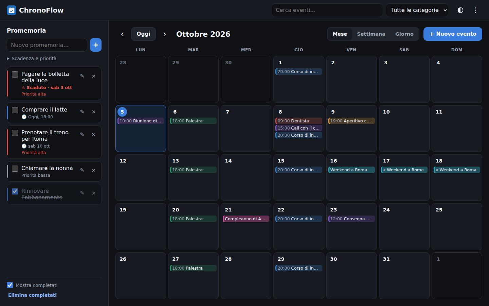
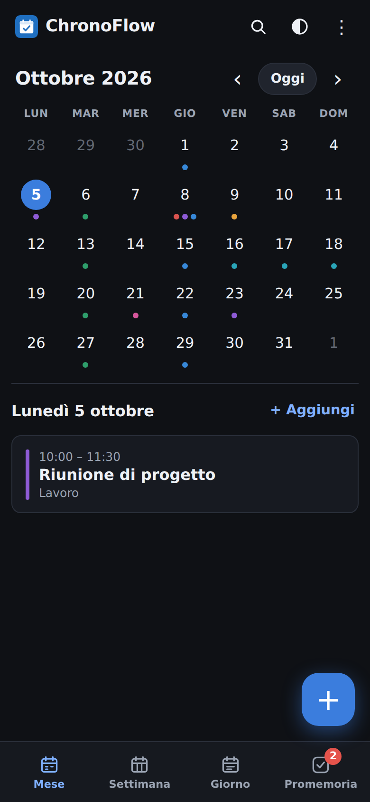
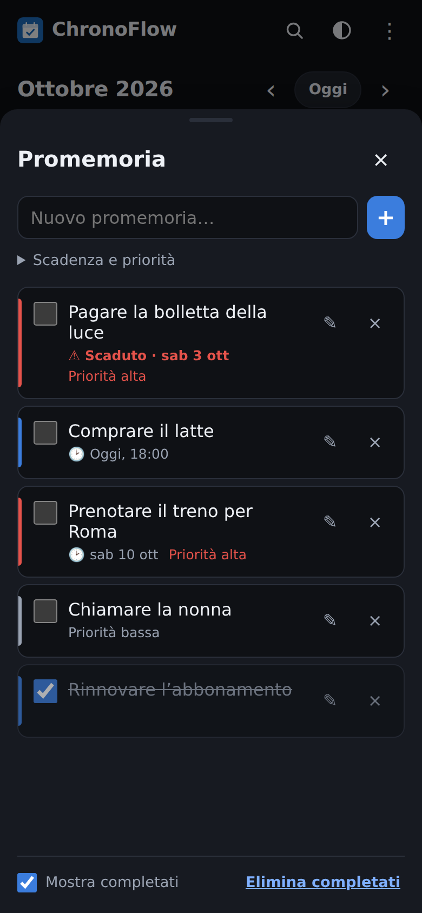

<div align="center">


# ChronoFlow

Calendario e promemoria personali, con notifiche push sul telefono.
Funziona nel browser e si installa come app (PWA).

[](https://github.com/federicogiraldi/ChronoFlow/actions/workflows/ci.yml)




&nbsp;

&nbsp;


</div>

## Cosa fa

- **Calendario** mese, settimana e giorno; eventi con orario o di tutto il giorno, colore, categoria, ripetizione (giorno, settimana, mese, anno).
- **Promemoria** con scadenza e priorità.
- **Notifiche push** prima degli eventi e alla scadenza dei promemoria, anche ad app chiusa.
- **Ricerca**, filtro per categoria, import/export **`.ics`** (Google, Apple, Outlook).
- **Installabile e offline**: senza connessione si consultano i dati, ma non si modificano.
- **Tema** chiaro/scuro e **password** di accesso.

Sul telefono: tocca un giorno del mese per vederne gli eventi, usa la barra in basso per cambiare vista o aprire i promemoria e il pulsante **+** per creare un evento. Scorri a destra/sinistra per cambiare periodo. Le notifiche si attivano dal menu **⋮**.

## Come funziona

```
Browser / app installata ──/api (JSON)──▶ Node.js + Express ──▶ SQLite (locale) o Turso (online)
        │                                        ▲
   service worker                     cron-job.org, ogni minuto:
   (cache offline)                    /api/cron/notify → invia le notifiche push
```

- **Frontend** (`frontend/`): HTML, CSS e JavaScript senza framework. Gli eventi ripetuti sono salvati una volta sola e le ripetizioni sono calcolate nel browser.
- **Backend** (`backend/`): Express valida i dati e li salva nel database. In locale parte con `backend/server.js`; su Vercel la stessa app gira come funzione serverless (`api/index.js`).
- **Notifiche**: ogni dispositivo si iscrive alle push; ogni minuto il server controlla cosa è in scadenza e invia l'avviso tramite il servizio push del telefono, una sola volta.

## Avvio in locale

Serve Node.js 22 o superiore.

```bash
npm install
npm start
```

Apri <http://localhost:3000>. Dal telefono sulla stessa rete Wi‑Fi usa l'indirizzo mostrato nel terminale. I dati finiscono in `backend/chronoflow.db`.

## Pubblicazione online (gratis)

Servono tre servizi, tutti gratuiti: **Turso** (database), **Vercel** (app) e **cron-job.org** (sveglia il server ogni minuto per le notifiche).

1. **Turso**: crea un database e copia l'URL (`libsql://…`) e un token.
2. **Chiavi**: esegui `npm run vapid` (chiavi per le push) e due volte `npm run secret` (una per `CRON_SECRET`, una per `SESSION_SECRET`).
3. **Vercel**: importa il repository e imposta le variabili d'ambiente (tabella sotto), poi **Deploy**. Ogni push su `main` viene pubblicato in automatico; dopo aver cambiato una variabile serve un **Redeploy**.
4. **cron-job.org**: crea un job ogni minuto su
   `https://<progetto>.vercel.app/api/cron/notify?key=<CRON_SECRET>`.
   La risposta attesa è `200` con `{"enabled":true,…}`.
5. **Telefono**: apri l'app, aggiungila alla schermata Home, aprila dall'icona e attiva le notifiche dal menu **⋮**. Arriva subito una notifica di prova.

> Su iPhone le push funzionano solo con l'app aggiunta alla schermata Home (iOS 16.4+).

Problemi col database? `npm run db:check` verifica la connessione con i valori del tuo `.env`, e `/api/health` mostra lo stato del server.

## Configurazione

In locale copia `.env.example` in `.env`. Su Vercel le stesse variabili vanno nelle impostazioni del progetto.

| Variabile                               | A cosa serve                                                  |
| --------------------------------------- | ------------------------------------------------------------- |
| `DATABASE_URL`, `DATABASE_AUTH_TOKEN`   | Database Turso. Vuote: file locale `backend/chronoflow.db`    |
| `APP_PASSWORD`                          | Password di accesso. **Obbligatoria online**                  |
| `SESSION_SECRET`                        | Chiave per firmare il cookie di accesso                       |
| `NODE_ENV`                              | `production` online (cookie sicuri, HTTPS)                    |
| `VAPID_PUBLIC_KEY`, `VAPID_PRIVATE_KEY` | Chiavi delle notifiche push (`npm run vapid`)                 |
| `VAPID_SUBJECT`                         | `mailto:` + la tua email                                      |
| `CRON_SECRET`                           | Protegge `/api/cron/notify`                                   |
| `APP_TIMEZONE`                          | Fuso orario delle notifiche (online di default `Europe/Rome`) |

## Sviluppo

| Comando            | Cosa fa                             |
| ------------------ | ----------------------------------- |
| `npm run dev`      | Server con riavvio automatico       |
| `npm test`         | Test unitari e delle API            |
| `npm run test:e2e` | Test nel browser (desktop e mobile) |
| `npm run check`    | Lint, formattazione e test          |

## Limiti

- Le notifiche possono arrivare fino a un minuto in ritardo (il controllo è ogni minuto).
- Gli orari sono in ora locale: pensato per un solo fuso orario.
- Modifiche ed eliminazioni di un evento ripetuto valgono per tutta la serie.
- I promemoria non sono inclusi nell'export `.ics`.
